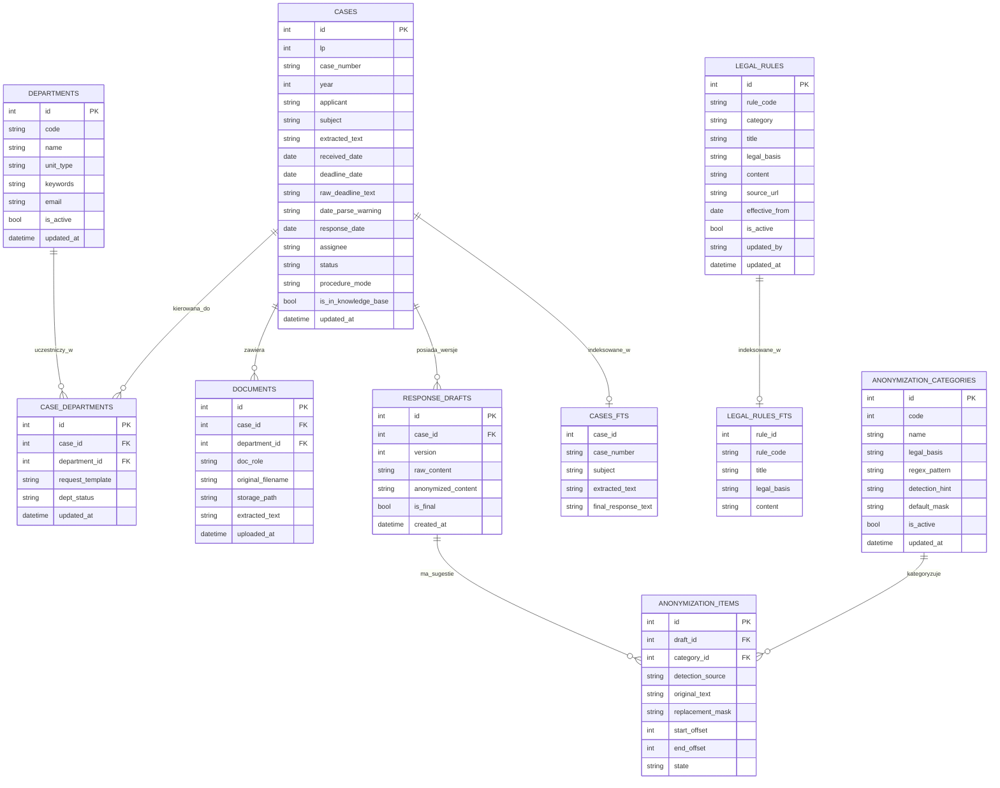

```mermaid
erDiagram
    CASES ||--o{ CASE_DEPARTMENTS : "kierowana_do"
    DEPARTMENTS ||--o{ CASE_DEPARTMENTS : "uczestniczy_w"
    CASES ||--o{ DOCUMENTS : "zawiera"
    CASES ||--o{ RESPONSE_DRAFTS : "posiada_wersje"
    RESPONSE_DRAFTS ||--o{ ANONYMIZATION_ITEMS : "ma_sugestie"
    CASES ||--o| CASES_FTS : "indeksowane_w"

    LEGAL_RULES ||--o| LEGAL_RULES_FTS : "indeksowane_w"
    ANONYMIZATION_CATEGORIES ||--o{ ANONYMIZATION_ITEMS : "kategoryzuje"

    CASES {
        int id PK
        int lp
        string case_number
        int year
        string applicant
        string subject
        string extracted_text
        date received_date
        date deadline_date
        string raw_deadline_text
        string date_parse_warning
        date response_date
        string assignee
        string status
        string procedure_mode
        bool is_in_knowledge_base
        datetime updated_at
    }

    LEGAL_RULES {
        int id PK
        string rule_code
        string category
        string title
        string legal_basis
        string content
        string source_url
        date effective_from
        bool is_active
        string updated_by
        datetime updated_at
    }

    ANONYMIZATION_CATEGORIES {
        int id PK
        int code
        string name
        string legal_basis
        string regex_pattern
        string detection_hint
        string default_mask
        bool is_active
        datetime updated_at
    }

    DEPARTMENTS {
        int id PK
        string code
        string name
        string unit_type
        string keywords
        string email
        bool is_active
        datetime updated_at
    }

    CASE_DEPARTMENTS {
        int id PK
        int case_id FK
        int department_id FK
        string request_template
        string dept_status
        datetime updated_at
    }

    DOCUMENTS {
        int id PK
        int case_id FK
        int department_id FK
        string doc_role
        string original_filename
        string storage_path
        string extracted_text
        datetime uploaded_at
    }

    RESPONSE_DRAFTS {
        int id PK
        int case_id FK
        int version
        string raw_content
        string anonymized_content
        bool is_final
        datetime created_at
    }

    ANONYMIZATION_ITEMS {
        int id PK
        int draft_id FK
        int category_id FK
        string detection_source
        string original_text
        string replacement_mask
        int start_offset
        int end_offset
        string state
    }

    CASES_FTS {
        int case_id
        string case_number
        string subject
        string extracted_text
        string final_response_text
    }

    LEGAL_RULES_FTS {
        int rule_id
        string rule_code
        string title
        string legal_basis
        string content
    }
```