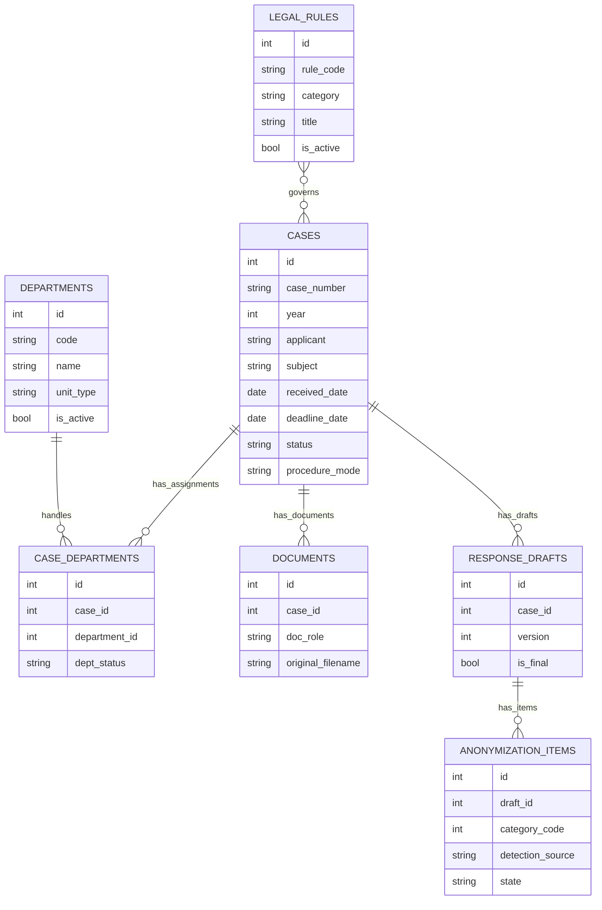

```mermaid
erDiagram
    CASES ||--o{ CASE_DEPARTMENTS : has_assignments
    DEPARTMENTS ||--o{ CASE_DEPARTMENTS : handles
    CASES ||--o{ DOCUMENTS : has_documents
    CASES ||--o{ RESPONSE_DRAFTS : has_drafts
    RESPONSE_DRAFTS ||--o{ ANONYMIZATION_ITEMS : has_items
    LEGAL_RULES }o--o{ CASES : governs

    CASES {
        int id
        string case_number
        int year
        string applicant
        string subject
        date received_date
        date deadline_date
        string status
        string procedure_mode
    }

    DEPARTMENTS {
        int id
        string code
        string name
        string unit_type
        bool is_active
    }

    CASE_DEPARTMENTS {
        int id
        int case_id
        int department_id
        string dept_status
    }

    DOCUMENTS {
        int id
        int case_id
        string doc_role
        string original_filename
    }

    RESPONSE_DRAFTS {
        int id
        int case_id
        int version
        bool is_final
    }

    ANONYMIZATION_ITEMS {
        int id
        int draft_id
        int category_code
        string detection_source
        string state
    }

    LEGAL_RULES {
        int id
        string rule_code
        string category
        string title
        bool is_active
    }
```